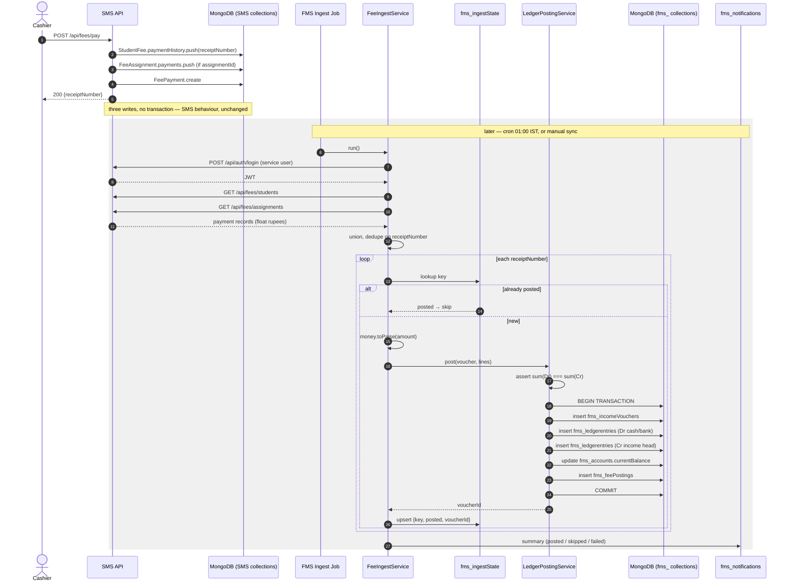

# P0.4 — Integration Architecture & Points

**Project:** The Future Step School ERP (SMS) + Financial Management System (FMS) plugin
**Phase:** Discovery P0.4 · **Date:** 2026-07-27
**Status:** Design only — no code
**Inputs:** `docs/discovery/02_functionality_audit.md`, `docs/discovery/03_db_reconciliation.md`, `DATA_DICTIONARY_v3.md`, `01_SRS_v4`, `05_Workflow_BPMN`, `openapi.yaml`, live code (`backend/routes/*`, `backend/models/*`, `backend/middleware/auth.js`)

---

## 0. Executive summary

**Only three of the six touchpoints are actual SMS integrations.** The other three have no SMS counterpart and are wholly FMS-internal — which simplifies the build considerably, but means the FMS is the system of record for them with no upstream to reconcile against.

| # | Touchpoint | SMS source exists? | Pattern |
|---|---|---|---|
| 1 | Fee Collection → FMS | ✅ yes | Cron batch pull + manual trigger |
| 2 | Payroll → FMS | ✅ yes | Cron batch pull + manual trigger |
| 3 | Inventory/Purchase → FMS | ❌ **none** | FMS-internal, no integration |
| 4 | Payment Gateway | ❌ **none** | Deferred — no gateway installed |
| 5 | Bank statement import | ❌ **none** | FMS-internal file upload |
| 6 | Shared Auth & RBAC | ✅ yes | Synchronous, per-request |

### Findings that change the plan

| # | Finding | Severity | Effect |
|---|---|---|---|
| **G1** | `SalarySlip.deductions` has only `{pf, tax, loan, other}`. **No ESIC field. No Professional Tax field.** | **BLOCKING** | The payroll posting rule requested cannot be built as specified. ESIC/PT are either not deducted at this school or are buried inside `other` — and `other` cannot be split |
| **G2** | The FMS service user must hold `superAdmin`, `schoolAdmin` or `accountant` to read fee data. **All three can also `DELETE` fee payments.** No read-only finance role exists | **HIGH** | The FMS service credential is over-privileged by construction. A leaked service token can destroy financial records |
| **G3** | `JWT_EXPIRE=30d`. A statically-issued service token silently expires after 30 days | **HIGH** | Ingest stops with 401s and no alarm unless the FMS re-authenticates programmatically |
| **G4** | `SalarySlip.paymentDate` defaults to `Date.now` at **creation**, not at the `status → paid` transition | MEDIUM | "When was this salary paid" is unreliable; posting date must come from the ingest timestamp, not the source field |
| **G5** | `FeePayment.transactionId` is free-text with no gateway contract | MEDIUM | Online-payment reconciliation (touchpoint 4) has no machine-readable settlement reference |

G1 and G2 need a decision before P1.1.

---

## 1. Architectural constraint (inherited from P0.3)

The plugin **cannot use in-process events**. It has no access to SMS model middleware, controllers, or hooks. Every SMS integration is therefore:

```
cron tick (or manual POST /api/fms/integrations/*/sync)
  → authenticate as FMS service user (cached token)
  → GET <SMS REST endpoint>
  → for each source record:
       key = idempotency key
       if fms_ingestState[key].status === 'posted' → skip
       else → convert money to paise → LedgerPostingService.post() inside txn
              → upsert fms_ingestState
  → write fms_ingestState summary + surface failures
```

**Direction is always FMS-pull.** The SMS is never modified to push.

**Consistency is eventual.** A fee receipt exists in the SMS the instant it is taken; it exists in the ledger at the next ingest cycle. The gap is bounded by the cron interval.

---

## 2. Touchpoint 1 — Fee Collection → FMS

### 2.1 Contract

| Aspect | Value |
|---|---|
| **Trigger** | Cron `0 1 * * *` (01:00 IST daily) + manual `POST /api/fms/integrations/fees/sync` |
| **Direction** | FMS pulls |
| **Pattern** | **Batch job.** Not synchronous — the SMS controller cannot call the FMS |
| **SMS endpoints** | `GET /api/fees/students` (StudentFee ledgers incl. `paymentHistory[]`)<br>`GET /api/fees/assignments` (FeeAssignment incl. `payments[]`)<br>`GET /api/fees/types` (fee-type master, for account mapping) |
| **Auth** | `Authorization: Bearer <service token>` |
| **Idempotency key** | **`receiptNumber`** — see §2.3 |
| **Volume** | ~500 payment records total. Full re-scan per cycle is negligible |

### 2.2 Source union (deviation from DD §9 — carried from P0.3 F1)

P0.3 established that `payAssignment` mirrors into `StudentFee` **only when a ledger already exists**, and 426 assignments against 56 ledgers means most payments taken that way are recorded in `FeeAssignment.payments[]` alone.

```
sources = StudentFee.paymentHistory[]  ∪  FeeAssignment.payments[]
key     = receiptNumber
FeePayment is ignored entirely (legacy mirror, same receiptNumber)
```

Because `recordPayment` writes the same `receiptNumber` to all three, the union self-deduplicates for dual-written payments and recovers assignment-only payments that DD §9 would drop.

### 2.3 Idempotency key: `receiptNumber`, with a guarded fallback

`receiptNumber` is the only key shared across all three fee writes. Subdocument `_id`s differ per array for the same logical payment, so they cannot serve as a cross-source key.

**Preconditions — must be verified before first ingest (P0.3 §7):**

1. No null/blank `receiptNumber` in either array
2. No duplicate `receiptNumber` within or across the two arrays

**If either fails**, the key degrades to a composite hash: `sha1(studentId + paidOn.toISOString() + amount + method)`. This is weaker — two genuinely identical same-day payments would collapse into one — so a duplicate/blank receipt number should be treated as a data defect to fix in the SMS, not designed around permanently.

### 2.4 Data contract

**In (from SMS, per payment):**

| Field | Type | Use |
|---|---|---|
| `receiptNumber` | String | Idempotency key |
| `amount` | Number (float ₹) | → `money.toPaise()` |
| `paidOn` | Date | Voucher date, FY assignment |
| `method` | enum `cash\|online\|cheque\|bank\|upi` | Determines debit head |
| `transactionId` | String | Reference only |
| `collectedBy` | ObjectId → User | Stored opaque |
| `student` (parent doc) | ObjectId | Party reference + denormalised name |
| `feeType` (FeeAssignment only) | ObjectId → FeeType | Determines credit head |
| `month`, `year` | String, Number | FY parsing (free-text `"April 2026"` — parse defensively) |

**Out (FMS writes):** one `fms_incomeVouchers` doc, two balanced `fms_ledgerentries` rows, one `fms_feePostings` row, one `fms_ingestState` row.

### 2.5 GL posting rule

```
Dr  <cash or bank head, per method>     amountPaise
    Cr  <income head, per fee type>                 amountPaise
```

Debit head selection:

| `method` | Debit account |
|---|---|
| `cash` | `1101 Cash in Hand` |
| `bank`, `cheque` | `1201 Bank — Current A/c` |
| `online`, `upi` | `1202 Bank — Online Collections` (clearing head; settles to 1201 on bank reconciliation) |

**Note on `upi`/`online`:** posting these straight to the main bank head would overstate the bank balance until settlement actually lands. Routing them through a clearing head keeps the ledger honest and gives touchpoint 5 something to reconcile against.

**Fallback:** a payment from `StudentFee.paymentHistory[]` carries no `feeType` (the ledger is fee-type agnostic). Those post to `4109 Fee Income — Unclassified` and are flagged in the reconciliation report for manual reclassification. Payments from `FeeAssignment.payments[]` do carry `feeType` and map precisely.

This asymmetry is a consequence of the SMS's three-system design, not a defect in the FMS.

### 2.6 Error and retry handling

| Failure | Handling |
|---|---|
| SMS unreachable | Abort cycle, log, retry next tick. No partial state — nothing posted yet |
| 401 from SMS | Re-authenticate once, retry. Second 401 → alert (G3) |
| Single record fails to post | Mark `fms_ingestState[key].status = 'failed'` with the error, **continue the batch**. Retried next cycle |
| Ledger posting unbalanced | Transaction aborts. Record `failed`. This is a code defect — alert immediately |
| Receipt present in FMS but gone from SMS | Post a **compensating reversal**, flag in reconciliation (H8/H9/H10) |
| Money conversion produces non-integer | Reject the record, flag. Never round twice |

---

## 3. Touchpoint 2 — Payroll → FMS

### 3.1 ⚠️ G1 — the requested posting cannot be built as specified

The prompt asks for **Salary Expense, Salary Payable, PF, ESIC, Professional Tax, TDS**. The actual `SalarySlip` schema is:

```javascript
allowances: { hra, da, ta, medical, other }
deductions: { pf, tax, loan, other }
basicSalary, grossSalary, netSalary
```

| Requested component | Available? |
|---|---|
| Salary Expense | ✅ `grossSalary` |
| Salary Payable | ✅ `netSalary` |
| PF | ✅ `deductions.pf` |
| TDS | ✅ `deductions.tax` |
| **ESIC** | ❌ **no field** |
| **Professional Tax** | ❌ **no field** |
| Loan recovery | ✅ `deductions.loan` — **present but not in the requested list** |

**Options:**

- **(a) Post only what exists.** ESIC and PT heads are created in the Chart of Accounts but never posted from ingest. If the school does deduct them, they are inside `other` and invisible. *Recommended.*
- **(b) Treat `deductions.other` as a single "Other Deductions" head.** Honest, but loses the statutory breakdown a compliance report would need.
- **(c) Add `esic` and `professionalTax` to `SalarySlip`.** Correct long-term, but modifies an SMS model — outside the plugin constraint, and a sanctioned-change decision like D3.

**Before choosing, confirm the factual question with the school: does The Future Step School deduct ESIC or Professional Tax at all?** With 13 teachers and 4 salary slips in the system, it may simply not apply. If it doesn't, option (a) is not a compromise — it's correct.

### 3.2 Contract

| Aspect | Value |
|---|---|
| **Trigger** | Cron `0 2 * * *` + manual `POST /api/fms/integrations/payroll/sync` |
| **Pattern** | Batch job |
| **SMS endpoint** | `GET /api/salary` (filter `status === 'paid'` client-side — no query param exists) |
| **Idempotency key** | `salarySlip._id` — backed by the unique index `{school, teacher, month, year}` |
| **Volume** | 4 documents today |

### 3.3 GL posting rule (option (a))

```
Dr  5101 Salary & Wages Expense        grossSalaryPaise
    Cr  2101 Salary Payable                        netSalaryPaise
    Cr  2102 PF Payable                            pfPaise
    Cr  2103 TDS Payable                           taxPaise
    Cr  2104 Staff Loan Recovery                   loanPaise
    Cr  2109 Other Deductions Payable              otherPaise
```

**Balance assertion:** `gross === net + pf + tax + loan + other`. If a slip fails this, **do not post** — flag it. The SMS computes `grossSalary`/`netSalary` in the controller with no schema-level guarantee they reconcile, so this check is load-bearing.

On payment settlement (FMS-side, when Salary Payable is cleared):

```
Dr  2101 Salary Payable                netPaise
    Cr  1201 Bank — Current A/c                    netPaise
```

### 3.4 G4 — posting date

`paymentDate` defaults to `Date.now` at document creation, before `status` becomes `paid`. It therefore records when the slip was *drafted*, not when salary was *paid*.

**Rule:** use `paymentDate` as the voucher date **only if** `status === 'paid'` and `paymentDate <= now`. Otherwise use `updatedAt`. Record both in `fms_payrollPostings` so the choice is auditable.

### 3.5 Status reversal

A slip can move `paid → pending` (nothing prevents it). If the FMS has already posted:

1. Detect on the next cycle: `fms_ingestState` says posted, source says not paid
2. Post a reversal voucher
3. Set `fms_ingestState[key].status = 'reversed'`
4. If it returns to `paid` later, post fresh with a new voucher number — **never** un-reverse

---

## 4. Touchpoint 3 — Inventory / Purchase → FMS

**There is no SMS source.** No procurement model, no vendor model, no inventory model, no purchase routes. Confirmed in P0.3 §2.1.

This is **not an integration**. Purchase requests, purchase orders, goods receipts and vendor payables are wholly FMS-owned (`fms_purchaseRequests`, `fms_purchaseOrders`, `fms_goodsReceipts`, `fms_vendors`). Postings are FMS-internal and therefore **fully transactional** — no eventual-consistency trade applies.

GL rules (internal, for completeness):

```
On goods receipt:
Dr  <expense or asset head, per PO line>    amountPaise
    Cr  2201 Sundry Creditors — <vendor>              amountPaise

On payment:
Dr  2201 Sundry Creditors — <vendor>        amountPaise
    Cr  1201 Bank / 1101 Cash                         amountPaise
```

**One boundary does exist:** SMS `Expense` records. Those are consumed read-only via `GET /api/expenses` as an *input* to the FMS expense workflow — the FMS creates its own `fms_expense` document and never writes back. Idempotency key: `expense._id`. This is a genuine ingest and follows the same pattern as §2.

---

## 5. Touchpoint 4 — Payment Gateway

**No gateway is installed.** The SMS `method` enum accepts `online` and `upi`, and `transactionId` is a free-text string, but there is no gateway SDK, no webhook route, no settlement model, and no gateway credentials in `.env`.

**Status: deferred.** The design that will apply when a gateway is added:

| Aspect | Value |
|---|---|
| Pattern | **Webhook** (gateway → FMS), the only touchpoint where push is correct |
| FMS endpoint | `POST /api/fms/integrations/gateway/webhook` |
| Idempotency key | Gateway settlement reference |
| Posting | `Dr 1201 Bank — Current A/c` / `Cr 1202 Bank — Online Collections` |

Until then, `online`/`upi` payments accumulate in the `1202` clearing head and are cleared manually during bank reconciliation (§6). **This is a real, ongoing manual task**, not a stub — worth telling the school it exists.

---

## 6. Touchpoint 5 — Bank statement import & reconciliation

**No SMS source.** Fully FMS-owned.

| Aspect | Value |
|---|---|
| Trigger | Manual upload (CSV/Excel) via `POST /api/fms/banking/import` |
| Pattern | **Batch, user-initiated.** Not a cron — statements arrive irregularly |
| Idempotency key | `sha1(bankAccountId + valueDate + amount + narration + runningBalance)` |
| Storage | `fms_bankTransactions` (raw) → matched against `fms_ledgerentries` on the bank head |
| Output | `fms_bankReconciliations` with matched / unmatched / suggested |

Matching is a suggestion engine, never automatic posting. An unmatched bank line becomes a journal voucher only when a human approves it. This is the control that keeps an import from silently inventing ledger entries.

---

## 7. Touchpoint 6 — Shared Auth & RBAC

### 7.1 Two distinct auth paths

**Path A — the FMS acting as a client of the SMS** (ingest). Needs a service user.
**Path B — a human using FMS screens.** Reuses their existing SMS JWT; the FMS applies its own authorization on top.

### 7.2 Path A — service user (E5)

```
POST /api/auth/login  { email: 'fms-service@thefuturestepschool.in', password: <secret> }
  → { token }  (expires per JWT_EXPIRE = 30d)
```

**⚠️ G2 — over-privileged by construction.** Every fee/salary/expense read route gates on `authorize('superAdmin','schoolAdmin','accountant')`. The service user must hold one of those. All three also permit:

- `DELETE /api/fees/payment/:receiptNumber`
- `POST /api/fees/ledger/bulk-delete`
- `DELETE /api/salary/:id`
- `DELETE /api/expenses/:id`

**There is no read-only finance role in the SMS.** A read-scoped service account is not expressible in the current model.

Mitigations, in ascending order of effort:

1. **Role `accountant`** (narrowest of the three), long random password, credentials only in the FMS `.env`, never in git. Minimum bar.
2. **`RolePermission` matrix row** for a dedicated role with `read` on finance modules — but `checkPermission` **fails open** when no matrix row exists, and the route's own `authorize()` still passes, so this constrains less than it appears. Verify empirically before relying on it.
3. **E4/E5 properly**: add a `service` or `financeReadOnly` role to the SMS enum with read-only route gating. Modifies the SMS — a D3-class decision.

**Recommendation:** ship with (1), and treat (3) as a prerequisite for handing the system to anyone outside the current two-person team.

### 7.3 G3 — token lifecycle

A 30-day token issued once will expire mid-life and ingest will fail silently with 401s.

**Rule:** the FMS never stores a static token. It authenticates programmatically, caches the token in memory with an expiry ~24h short of the JWT's, and re-authenticates on cache miss or on any 401. A second consecutive 401 raises an alert rather than retrying indefinitely.

### 7.4 Path B — FMS authorization for humans

```
Request → SMS protect (verify JWT, load User)
        → FMS deny-by-default wrapper:
             lookup fms_roleAssignments[user._id]
             if none                     → 403          ← deny by default
             if level < required for key → 403
             else                        → next()
```

**The FMS wrapper does not reuse SMS `checkPermission`.** Confirmed from the source: that middleware returns `next()` when no matrix row exists for the role, explicitly to preserve behaviour for unconfigured schools. Correct for the SMS; unacceptable for a ledger. The SMS middleware is left untouched.

Role realisation (DD §1, D3 default — no SMS enum change):

| SRS role | SMS `User.role` | `fms_roleAssignments.financeRole` |
|---|---|---|
| Chairman | `superAdmin` | `chairman` |
| Trustee | `superAdmin` | `trustee` |
| Principal | `schoolAdmin` | `principal` |
| Vice Principal | `schoolAdmin` | `vicePrincipal` |
| Accounts Manager | `accountant` | `accountsManager` |
| Accountant | `accountant` | `accountant` |
| Cashier | `accountant` | `cashier` |
| Purchase Officer | *any* | `purchaseOfficer` |
| Department Head | `teacher` | `deptHead` |
| Auditor | *any* | `auditor` (read-only) |
| Read Only | *any* | `readOnly` |

FMS module keys: `accounts, income, expenses, approvals, budgets, vendors, purchase, banking, pettyCash, ledger, journal, payments, financialReports, audit, financialYear`.

---

## 8. Account mapping table

Chart of Accounts codes are proposals — confirm with the school's accountant before seeding.

### 8.1 Fee type → income head

`FeeType.category` enum is `tuition | exam | transport | uniform | library | sports | other`. Mapping is seeded per `FeeType._id` via `fms_accounts.feeType`, defaulting by category.

| FeeType category | Account code | Account name | Type | Posting |
|---|---|---|---|---|
| `tuition` | 4101 | Tuition Fee Income | income | Cr |
| `exam` | 4102 | Examination Fee Income | income | Cr |
| `transport` | 4103 | Transport Fee Income | income | Cr |
| `uniform` | 4104 | Uniform Sales Income | income | Cr |
| `library` | 4105 | Library Fee Income | income | Cr |
| `sports` | 4106 | Sports Fee Income | income | Cr |
| `other` | 4107 | Other Fee Income | income | Cr |
| *(late fee accrual)* | 4108 | Late Fee Income | income | Cr |
| *(no feeType — StudentFee source)* | 4109 | Fee Income — Unclassified | income | Cr |

### 8.2 Payment method → debit head

| `method` | Code | Account | Type | Posting |
|---|---|---|---|---|
| `cash` | 1101 | Cash in Hand | asset | Dr |
| `bank`, `cheque` | 1201 | Bank — Current A/c | asset | Dr |
| `online`, `upi` | 1202 | Bank — Online Collections (clearing) | asset | Dr |

### 8.3 Payroll component → head

| SalarySlip field | Code | Account | Type | Posting |
|---|---|---|---|---|
| `grossSalary` | 5101 | Salary & Wages Expense | expense | Dr |
| `netSalary` | 2101 | Salary Payable | liability | Cr |
| `deductions.pf` | 2102 | PF Payable | liability | Cr |
| `deductions.tax` | 2103 | TDS Payable | liability | Cr |
| `deductions.loan` | 2104 | Staff Loan Recovery | liability | Cr |
| `deductions.other` | 2109 | Other Deductions Payable | liability | Cr |
| *(no source — G1)* | 2105 | ESIC Payable | liability | — **never posted from ingest** |
| *(no source — G1)* | 2106 | Professional Tax Payable | liability | — **never posted from ingest** |

### 8.4 Expense category → head

Seeded per `ExpenseCategory._id` via `fms_accounts.expenseCategory`. Only 2 categories exist today, so this is a small manual mapping at seed time rather than a rule.

| Source | Code | Account | Type | Posting |
|---|---|---|---|---|
| SMS `Expense.category` | 52xx | *(per category)* | expense | Dr |
| unmapped | 5299 | Other Expenses | expense | Dr |

### 8.5 Purchase event → head (FMS-internal)

| Event | Dr | Cr |
|---|---|---|
| Goods receipt | 52xx expense / 12xx asset | 2201 Sundry Creditors |
| Vendor payment | 2201 Sundry Creditors | 1201 Bank / 1101 Cash |
| Advance to vendor | 1301 Advances to Vendors | 1201 Bank |

---

## 9. Sequence diagram — fee receipt to balanced posting



The transaction boundary sits entirely inside the FMS. It does not — and cannot — span the REST call.

---

## 10. Consolidated integration table

| Integration | Pattern | Source hook | FMS endpoint | Idempotency key | Failure handling |
|---|---|---|---|---|---|
| Fee → Ledger | Batch (cron 01:00 + manual) | `GET /api/fees/students`, `GET /api/fees/assignments` | `POST /api/fms/integrations/fees/sync` | `receiptNumber` | Per-record failure logged, batch continues, retried next cycle |
| Payroll → Ledger | Batch (cron 02:00 + manual) | `GET /api/salary` | `POST /api/fms/integrations/payroll/sync` | `salarySlip._id` | Balance assertion must pass; unbalanced slip flagged, not posted |
| Expense ingest | Batch (cron 02:30 + manual) | `GET /api/expenses` | `POST /api/fms/integrations/expenses/sync` | `expense._id` | As above |
| Purchase → Ledger | **In-process (FMS-internal)** | none — FMS-owned | `POST /api/fms/purchase/*` | FMS `_id` | Fully transactional; no eventual consistency |
| Payment gateway | **Deferred** — webhook when added | none — no gateway installed | `POST /api/fms/integrations/gateway/webhook` | settlement ref | n/a until a gateway exists |
| Bank import | Batch, user-initiated | none — file upload | `POST /api/fms/banking/import` | `sha1(acct+date+amt+narration+balance)` | Duplicate rows skipped; unmatched need human approval |
| Auth (service) | Synchronous, cached | `POST /api/auth/login` | n/a | n/a | Re-auth on 401; alert on second consecutive 401 |
| Auth (human) | Synchronous, per-request | SMS JWT via `protect` | FMS deny-by-default wrapper | n/a | 403 when no `fms_roleAssignments` row |
| Reconciliation | Batch (cron 03:00 + on demand) | all above | `GET /api/fms/integrations/reconciliation` | n/a | Report only — never auto-corrects |

---

## 11. Reconciliation rules — no source event posts twice

**R1 — One key, one posting.** Every ingested record writes exactly one `fms_ingestState` row keyed by its idempotency key. `{sourceSystem, key}` carries a **unique index**. A duplicate insert throws and is caught as "already posted", so concurrency cannot double-post even if two ingests overlap.

**R2 — State written inside the posting transaction.** `fms_ingestState` is upserted in the *same* transaction as the ledger entries. A crash between posting and state-recording is impossible; either both exist or neither does.

**R3 — `FeePayment` is never a source.** It mirrors the same `receiptNumber` and would double-count. Ignored entirely.

**R4 — Union deduplication before posting.** `StudentFee.paymentHistory[]` and `FeeAssignment.payments[]` are merged and deduplicated on `receiptNumber` *before* the posting loop, so a dual-written payment is one record by the time it reaches the ledger.

**R5 — Reversal, never deletion.** A source record that disappears gets a compensating reversal voucher; state moves to `reversed`. The original posting is never removed. `fms_ledgerentries` has no delete path.

**R6 — Reversal is terminal for that key.** Once reversed, a reappearing source record posts as a **new** voucher with a new number. A reversal is never undone — otherwise the audit trail becomes non-linear.

**R7 — Balance assertion is a precondition, not a post-check.** `money.isBalanced(lines)` runs before the transaction opens. An unbalanced set never reaches the database.

**R8 — Conversion happens once.** `money.toPaise()` is called at ingest only. `fms_feePostings.sourceAmount` retains the original float so the conversion is provable.

**R9 — Reconciliation reports, never corrects.** `GET /api/fms/integrations/reconciliation` lists SMS records with no FMS posting, FMS postings with no SMS record, and amount mismatches. Every correction is a human-approved journal voucher.

**R10 — Cycle-level idempotency.** A `fms_ingestState` row keyed `cycle:<integration>:<ISO date>` records each run. Re-running the same cycle is safe by R1; the cycle row exists for observability, not control.

---

## 12. Open items before P1.1

| # | Item | Owner | Blocks |
|---|---|---|---|
| **O1** | **G1** — does the school deduct ESIC / Professional Tax? If yes, choose option (a), (b) or (c) | School accountant | Payroll posting rule, CoA seed |
| **O2** | **G2** — accept over-privileged service user, or pursue E5 properly | Vijay | P1.3 auth |
| **O3** | Confirm Chart of Accounts codes with the school's accountant | Pratiksha | CoA seed (migration 004) |
| **O4** | Run P0.3 §7 queries — orphan receipts, null/duplicate receipt numbers | Vijay | Fee idempotency key |
| **O5** | Confirm cron cadence: daily 01:00 acceptable, or intra-day? | Vijay | P5.1 |
| **O6** | Production replica set (P0.3 F3) | Vijay | Phase 1 |
| **O7** | D1 deployment shape — in-process recommended | Vijay | P1.1 |

---

## 13. Definition of done for P0.4

- [x] All six touchpoints defined with trigger, direction, endpoint, contract, key, retry
- [x] Every named SMS endpoint verified present in `backend/routes/`
- [x] Every posting rule balances (Dr total = Cr total)
- [x] No touchpoint lacks an idempotency strategy
- [x] Account mapping table covering fee types, payroll components, expense categories, purchase events
- [x] Mermaid sequence diagram for fee receipt → voucher → balanced posting → notification
- [x] Consolidated integration table
- [x] Reconciliation rules R1–R10
- [ ] **O1 answered** — payroll rule cannot be finalised without it
- [ ] **O3 signed off** — CoA codes are proposals
- [ ] **O4 run** — idempotency key unconfirmed

P0.5 (Gap Analysis & Roadmap) can proceed in parallel; P1.1 should not start until O1, O4, O6 and O7 are closed.